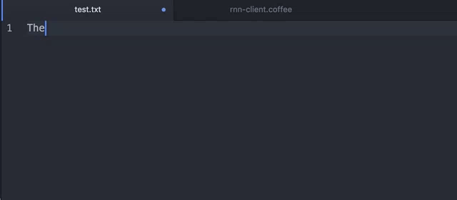
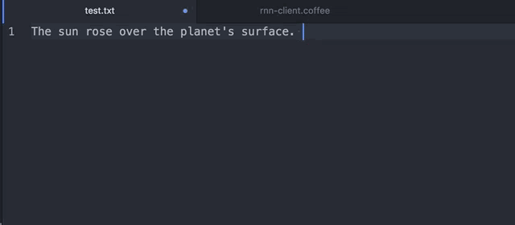

#rnn-writer

This is a package for the [Atom](https://atom.io/) text editor that works with [`torch-rnn-server`](https://github.com/robinsloan/torch-rnn-server) to provide responsive, inline "autocomplete" powered by a recurrent neural network trained on a corpus of sci-fi stories, or another corpus of your choosing.



I explain what this project is all about [here](https://www.robinsloan.com/note/writing-with-the-machine); it's probably worth reading that before continuing.

###Installation

After downloading and installing Atom, get thee to a command line and do the following:

```
git clone https://github.com/robinsloan/rnn-writer.git
cd rnn-writer
apm install
apm link
```

That last command -- `apm` stands for Atom Package Manager -- tells the application about the package.

Next, open Atom. Go to the Settings screen (`cmd+,`) and select Packages on the left. `rnn-writer` should be listed near the top. Enable it. Close Atom and reopen it again. Now you should be able to access `rnn-writer`'s settings -- again, `cmd+,` and find it near the top.

###Testing

To run tests, just run `apm test` while in the base directory.

###Configuration

The only thing missing is the location of a server to provide the "autocompletions." You have two options:

1. Download and set up [`torch-rnn-server`](https://github.com/robinsloan/torch-rnn-server) along with its dependencies, which are many -- but you can skip several if you're using a pretrained model. After doing this, tell `rnn-writer` where to find `torch-rnn-server`, e.g. at `http://localhost:8080`.
2. Or...

###text.bargains :)

I pretty strongly recommend running a local installation of `torch-rnn-server`, only because it makes the writing experience so very snappy and satisfying. But, if that's too daunting, I'm providing an API at `text.bargains` through which you can access a trained RNN... running on a computer... sitting under a table... in my office.

If you email me at `api@robinsloan.com` I'll happily set you up with an API key, with the understanding that this is a service provided for fun and experimentation and it could go offline at any time.

Okay SO: at this point, you either have `torch-rnn-server` running on your computer, or you've contacted me for a time-limited and vaguely suspicious `text.bargains` API key. Now, let's

###Use this thing!

This package only pays attention to files that have the `.txt` extension, so if you're typing in a fresh Atom window, be sure to save once (`noveldraft.txt`?) before proceeding.

**Activate the package using `cmd-shift-R`.**



Here are the controls, which should feel intuitive:

| This key| does this
|---------|---------
|`tab`    | show suggested completions at the text insertion point
|`down` | scroll down through completions (and get more if necessary)
|`up` | scroll back up
|`return` or `tab` again | accept the current completion
|`left` or `escape` | reject all completions and reset
|(anything else) | continue editing as usual

You can always use `cmd-shift-R` to deactivate the package and type normally again.

If you run into problems or have ideas for improvements, don't hesitate to open an issue. This is the first time I've bundled up code for other people to use, so I'm sure I made -- _am currently making_ -- some mistakes.

Enjoy!


